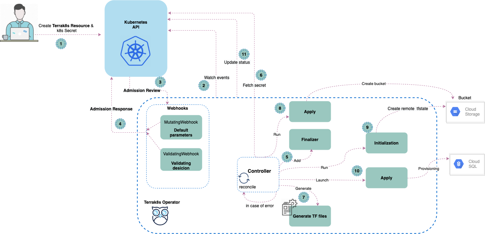

## terrak8s-operator 

Generate and manage Cloud SQL instances in a Kubernetes native way using [CustomResourceDefinitions](https://kubernetes.io/docs/tasks/extend-kubernetes/custom-resources/custom-resource-definitions/). 
Currently, terrak8s support **Cloud sql Postgres** on GCP, in the future releases we'll support Azure too, see [Roadmap](#roadmap). 

### Context 

Managing infrastructure resources in a cloud environment (e.g. GCP) has always been a tough challenge for developers when it comes to manage dependencies of their application. Fortunately terraform was created
to solve this kind of problem, however, it requires developers to have development knowledge of terraform and avoid screw things up by misusing names and managing shared/global resources

### Goals

At a high level, **terrak8s** was born to reduce the complexity of managing resources and eases the strain of your development team.  Also gives the ability
to deploy your cloud SQL instance alongside the application in a nice simple way (using helm or similar).

The core key features of **terrak8s** are :
* Infrastructure as Code
  - terrak8s ease the provision and automation of cloud SQL instance lifecycle as code by simply writing a YAML manifest.
* Native kubernetes [CustomResourceDefinitions](https://kubernetes.io/docs/tasks/extend-kubernetes/custom-resources/custom-resource-definitions/)
  - terrak8 makes it easy to manage cloud SQL resources by converting YAML manifest declaration to terraform resources using terrak8s API and standard kubernetes CLI. After applying the YAML, terrak8s will do all the heavy lift for you.
* Build on top of Terraform 
  - terrak8s use under the hood Terraform to provision cloud SQL instance.

  
### How does Terrak8s work ?
A controller is a simple software loop, often called the 'reconcile loop', that performs the following logic:
* Observe desired state.
* Observe the current state of the managed resources.
* Take action to bring the managed resources in-line with desired state.
* Repeat cycle; return to step 1.

#### Architecture
**terrak8s** designed to simplify cloud SQL instance lifecycle management based on **reconcile loop**. The following diagram shows a deep-dive view of how terrak8s works under the hood:

The resource creation process workflow as follows:
* step 1:
  - Developer or/and Ops creates the CR (a.k.a. custom resource) and k8s secrets as well. Secrets contain the access credentials of the project (a.k.a. GCP serviceAccount JSON key) and database users password.
* step 2 & step 3 & step 4:
  - The Terrak8s controller watch CRD event types (Added, Updated, Deleted) in the background. When a relevant event occurs on CR reconcile cycle started.
  - The kubernetes API server forward the CRD request to the registered webhooks list (MutatingWebhook,ValidatingWebhook), by sending an Admission Review. MutatingWebhook sets default CRD parameters settings spec. Afterwards ValidatingWebhook decides to validate or not the request by returning an Admission Review response to k8s API.
* step 5:
  - Terrak8s adds a Finalizer to the created CR. Finalizers provide a mechanism to inform the Kubernetes control plane that an action needs to take place before the standard Kubernetes garbage collection logic can be performed.
* step 6:
  - Terrak8s fetches created secrets in step 1.
* step 7:
  - Terrak8s generates TF (a.k.a. terraform) files based on the CRD spec.
* step 8:
  - Terrak8s create gcs bucket based on the CRD spec to store cloud SQL instance tfstate.  
* step 9:
  - Terrak8s runs terraform init to create a remote tfstate in the created bucket.
* step 10:
  - Afterwards, a successful initialization of tfstate, terrk8s launches terraform apply to provision a cloud SQL instance.
* step 11:
  - After a successful provisioning of the CRD, terrak8s updates the CRD status fields.
  
### How to use terrak8s
See [Terrak8sGuide](docs/Terrak8sGuide.md) to learn more on how to use terrak8s properly.

#### Development
Get started with [Local development](docs/LocalDevelopment.md) guide.

#### Roadmap:
* Add support for GCP Cloud SQL instance Mysql.
* Add support for Azure Database for PostgreSQL.

#### Contributing
We welcome any contributions from the community with open arms, If you're planning a new feature, please file an issue to discuss first.